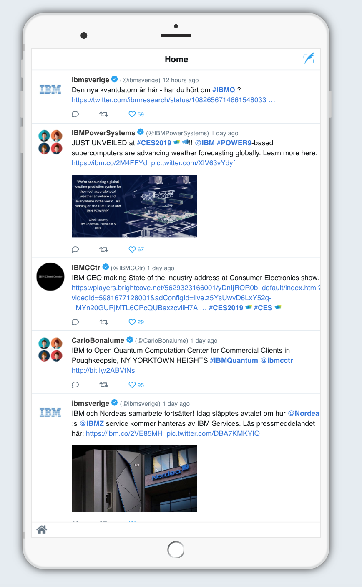

# Twitter Screen App based on Node.js hello world template

This application is used to display twitter tweets in a nice way on the client center screen.
The server is based on the Express framework.



The app displays the tweets and scrolls to the next, by default every 30 secs.
Periodically (every 5 mins) the app updates the tweets shown by calling an API.
 
The tweets are a mix of several sources, not just one Twitter handle.
The mix is optained by creating a rss feed mix from rssmix.com, since a similar API from twitter was not found.

To prevent ending up in cross origin blocking in the browser (CORS), the CORS PROXY from heroku is used.

If you try to hit the url directly from the browser it will fail because of missing header info.

Setting the required header with curl led to the inclusion of the 'headers' and 'beforeSend' in the ajax call.

```
$ curl -H "X-Requested-With: XMLHttpRequest" https://cors-anywhere.herokuapp.com/http://rssmix.com/<mychannel>/rss.xml
<?xml version="1.0" encoding="UTF-8"?>
<rss xmlns:dc="http://purl.org/dc/elements/1.1/" version="2.0">
  <channel>
    <title>TwitterscreenSE</title>
    <link>http://www.rssmix.com/</link>
    <description>This feed was created by mixing existing feeds from various sources.</description>
    <generator>RSSMix</generator>
    <item>
      <title>DevSecOps Matters for the Mainframe  http://ibmsystemsmag.com/mainframe/trends/security/devsecops-matters/?utm_source=SilverpopMailing&amp;utm_medium=email&amp;utm_campaign=010819-Z-EXTRA#.XDYXvysM6Og.twitter …</title>
      <link>https://twitter.com/IBMCCtr/status/1083028008007581697</link>
      <twitter:source xmlns:twitter="http://api.twitter.com" />
      <twitter:place xmlns:twitter="http://api.twitter.com" />
      <description>&lt;p class="TweetTextSize TweetTextSize--normal js-tweet-text tweet-text"  lang="en"&gt;DevSecOps Matters for the Mainframe   &lt;a href="http://ibmsystemsmag.com/mainframe/trends/security/devsecops-matters/?utm_source=SilverpopMailing&amp;#38;utm_medium=email&amp;#38;utm_campaign=010819-Z-EXTRA#.XDYXvysM6Og.twitter"&gt;http://ibmsystemsmag.com/mainframe/trends/security/devsecops-matters/?utm_source=SilverpopMailing&amp;#38;utm_medium=email&amp;#38;utm_campaign=010819-Z-EXTRA#.XDYXvysM6Og.twitter&amp;#160;&amp;#8230;&lt;/a&gt;&lt;/p&gt;</description>
      <pubDate>Wed, 09 Jan 2019 15:49:33 GMT</pubDate>
      <guid isPermaLink="false">https://twitter.com/IBMCCtr/status/1083028008007581697</guid>
      <dc:creator>(@IBMCCtr)</dc:creator>
      <dc:date>2019-01-09T15:49:33Z</dc:date>
    </item>
    <item>
```

Code snippet from index.js


    
    	const CORS_PROXY = "https://cors-anywhere.herokuapp.com/";
 
    	//feed to parse
		var feed = CORS_PROXY + "http://rssmix.com/<mychannel>/rss.xml";
		var settings = {
          url: feed,
          dataType: "xml",
          method: 'GET',
          beforeSend: function(xhr){xhr.setRequestHeader('X-Requested-With', 'XMLHttpRequest');},
          headers: {
              'X-Requested-With': 'XMLHttpRequest'
          },
          error: processNotOK,
          success: processOK	
      };

		$.ajax(settings);
	
Parsing the xml answer and setting the items in the tweet array was achieved with the .find() command.
One special case was the node 'dc:' with dc:creator and dc:date. With credits to https://stackoverflow.com/questions/853740/jquery-xml-parsing-with-namespaces it was solved as escaping the semi colon.
			
          	  	.find("dc\\:creator, creator").text()
          	  		

The options considered for the solution (and the change after YQL was deprecated on Jan 3 2019) is well described in this article:

https://www.raymondcamden.com/2015/12/08/parsing-rss-feeds-in-javascript-options


As you can see from the output from the twitter feed (xml), we don't get the number of likes. That number i generated in the app and set to a random number (1-100).

Ref:

Setting X-Requested-With
https://stackoverflow.com/questions/10996729/posting-from-curl-http-x-requested-with
 
Custom headers in ajax call
https://www.quora.com/How-do-I-send-custom-headers-using-jquery-Ajax-and-consume-the-same-header-in-WCF-using-C
 
Animate scroll  
https://stackoverflow.com/questions/9068587/accounting-for-a-fixed-header-with-animate-scrolltop-and-target-offset-top   

Getting the buttons and tweets positioning  
https://stackoverflow.com/questions/6435213/find-the-next-div-with-the-same-class-as-the-clicked-div   
http://jsfiddle.net/vV9C5/1/  

## Run the app locally

1. [Install Node.js][]
1. cd into this project's root directory
1. Run `npm install` to install the app's dependencies
1. Run `npm start` to start the app
1. Access the running app in a browser at <http://localhost:6001>

[Install Node.js]: https://nodejs.org/en/download/
